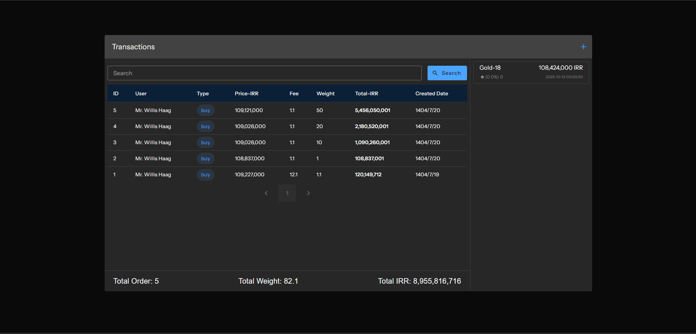
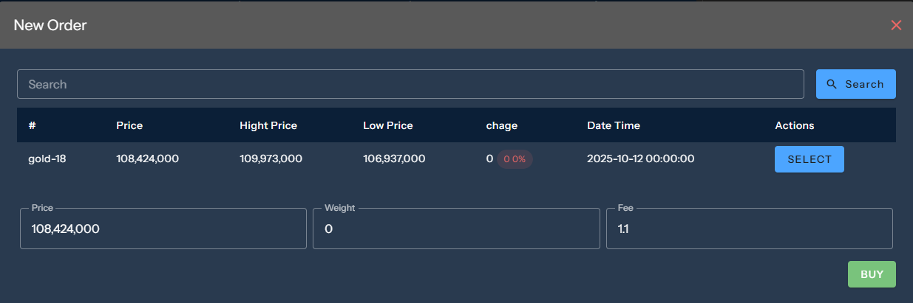

<h1 align="center">
  🟡 Hamrah Gold
</h1>

<p align="center">
  A modern full-stack web application built with <b>Laravel 12</b>, <b>Inertia.js</b>, <b>Vue 3</b>, <b>Vite</b>, <b>Tailwind CSS</b>, and <b>Wayfinder</b>.
</p>

<p align="center">
  
  
  
  
  
  
</p>

<p align="center">
  
  
</p>

---

## 🚀 Overview

**Hamrah Gold** is a modern, fast, and scalable full-stack web application using Laravel as the backend and Vue 3 (via Inertia.js) as the frontend.  
It provides a smooth SPA experience without losing the power of server-side routing and validation.

---

## 🧩 Tech Stack

| Layer | Technology |
|:------|:------------|
| Backend | Laravel 12 |
| Frontend | Vue 3 + Inertia.js |
| Build Tool | Vite |
| Styling | Tailwind CSS |
| Package Manager | pnpm |
| Form & UI Generator | Wayfinder |

---

## ⚙️ Installation & Setup

### 1️⃣ Clone the repository
```bash
git clone https://github.com/MajidAtaei1993/hamrah-gold.git
cd hamrah-gold
```

### 2️⃣ Install dependencies
```bash
composer install
composer update
pnpm install
```

### 3️⃣ Configure environment
```bash
cp .env.example .env
php artisan key:generate
```

Update `.env` file:
```env
APP_NAME=HamrahGold
APP_ENV=local
APP_DEBUG=true
APP_URL=http://hamrah-gold.test

VITE_APP_NAME="${APP_NAME}"
VITE_API_URL="${APP_URL}/api/"
```

### 4️⃣ Run migrations and seeders
```bash
php artisan migrate --seed
```

### 5️⃣ Generate Wayfinder components
```bash
php artisan wayfinder:generate --with-form
```

---

## 🧠 Development Workflow

Start backend:
```bash
php artisan serve
```

Start frontend:
```bash
pnpm dev
```

Access URLs:
- Backend → [http://127.0.0.1:8000](http://127.0.0.1:8000)
- Frontend → [http://localhost:5173](http://localhost:5173)

---

## 🗂️ Project Structure

```
hamrah-gold/
├── app/
├── bootstrap/
├── config/
├── database/
├── public/
│   └── images/
├── resources/
│   ├── js/
│   │   ├── Pages/
│   │   ├── Components/
│   │   ├── composables/
│   │   └── app.ts
│   ├── css/
│   └── views/
├── routes/
│   ├── web.php
│   └── api.php
├── docs/
│   ├── screenshot-1.png
│   └── screenshot-2.png
├── vite.config.ts
├── package.json
├── composer.json
└── README.md
```

---

## 🧰 Useful Commands

| Command | Description |
|:---------|:-------------|
| `php artisan serve` | Start Laravel backend |
| `pnpm dev` | Start frontend dev server |
| `php artisan migrate --seed` | Run database migrations |
| `php artisan wayfinder:generate --with-form` | Generate forms & components |
| `composer install / update` | Install PHP dependencies |

---

## 🖼️ Screenshots

| Dashboard | Example Page |
|------------|--------------|
|  |  |

---

## 🧑‍💻 Author

**Majid Ataei**  
Fullstack Developer — Laravel / Vue / Nuxt / NestJS  

[](https://github.com/MajidAtaei1993)
[](https://www.linkedin.com/in/majidataei)
[](mailto:majid.ataie79@gmail.com)

---

## 🪪 License
Released under the **MIT License**.

---

<p align="center">
  <sub>Built with ❤️ by <b>Majid Ataei</b></sub>
</p>
